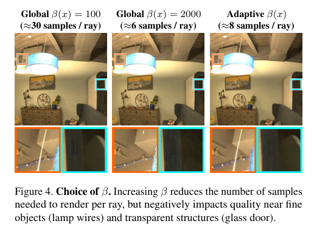
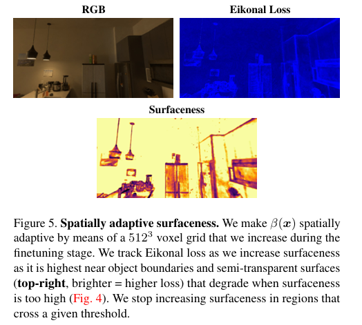
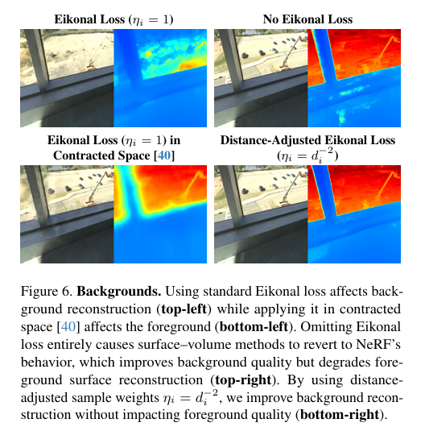
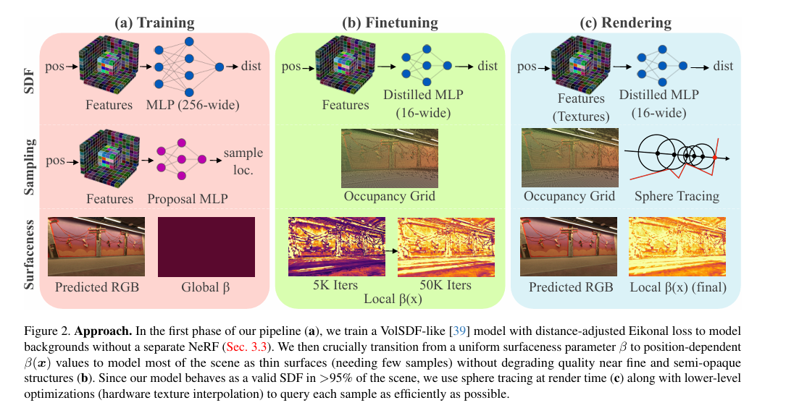
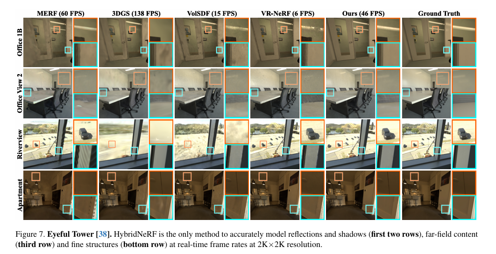
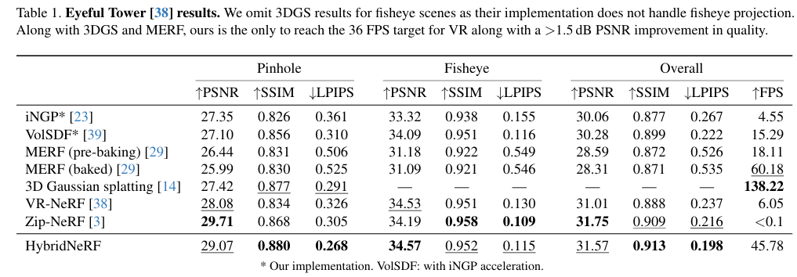
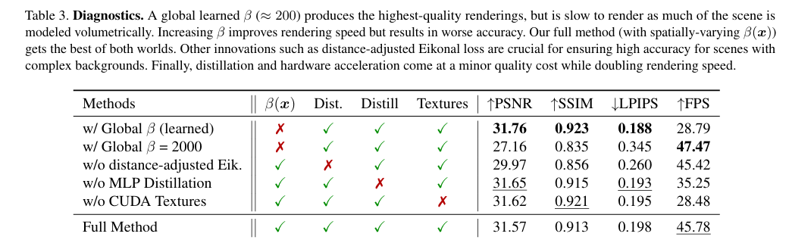

**Note: All images and tables used in this article are from the original paper, and here is the [link](https://openaccess.thecvf.com/content/CVPR2024/papers/Turki_HybridNeRF_Efficient_Neural_Rendering_via_Adaptive_Volumetric_Surfaces_CVPR_2024_paper.pdf) to the original paper.**

NeRF's success has almost given the impression that volume rendering + MLP can solve all new perspective compositing problems. However, when you actually try to use it in VR (2K×2K, at least 36 frames per second), NeRF tells you in a very straightforward way—**it's too slow**.

Where is the slowness? You can think of NeRF's rendering process as "integrating along a ray for each pixel." To ensure accurate integration, NeRF places many sampling points $x_i$ along the ray, and at each point, it queries the network: what is the density $\rho_i$, and what is the color $c_i$? Finally, these points are blended according to volume rendering weights to obtain the pixel color. The core formula of this process is:

$$
\hat{C}(r)=\sum_{i=1}^{N} w_i,c_i,
\quad
w_i = T_i \alpha_i,
\quad
\alpha_i = 1-e^{-\rho_i\delta_i},
\quad
T_i = \exp\Big(-\sum_{j<i}\rho_j\delta_j\Big)
$$

> **Each ray needs to be sampled many times, and the network needs to be run each time.**
> When the resolution reaches 2K×2K (approximately 4 million pixels), this rendering method of "dozens of MLPs per pixel" is inherently difficult to implement in real time.

## Reality is more like "surface" than "volume"

HybridNeRF's first step is not to fine-tune the sampling strategy, but to return to a common sense:
**we live in a world where most things are surfaces**：wall、table、floor、cabinet、car、human skin... they are more like "thin shell" than "mist" or "smoke".

If a scene is really "surface-dominated", then each ray theoretically only needs to do one thing:

> Find the intersection point with the surface, then sample the color at the intersection point.

This is much cheaper than NeRF's "integration along the ray"—from dozens of samples per pixel to just one sample per pixel.

In neural rendering, the most common "surface" representation is SDF (Signed Distance Function):

$$
f(x)=\text{Point }x\text{ to the nearest surface's signed distance}
$$

The surface corresponds to $f(x)=0$. If you can learn a reliable SDF, then rendering can be very fast—you can use sphere tracing to step towards the surface one step at a time (explained later).

It sounds beautiful, but the problem immediately appears:
**pure surface methods often fail to handle fine lines, transparency, thin structures, and some "non-ideal surface" phenomena**. For example, the fine wire of a light, glass door, thin fabric, fence, or even some things that look like reflection/highlight. They are easy to handle in volume rendering frameworks (because density can be "soft"), but they are easy to collapse in the "only one intersection point" surface framework.

So, at this point, the contradiction becomes clear:

* NeRF (volume rendering) advantage: strong expression ability, fine structure/semi-transparent more stable
  Disadvantage: slow, because sampling is more
* SDF (surface rendering) advantage: fast, because close to "one sample per ray"
  Disadvantage: some regions are difficult to accurately represent with "thin surface"

HybridNeRF's goal is to: **take the good things from both sides**.

## Key Bridge: Transform SDF into density that can be rendered by volume rendering

You might ask: SDF and volume rendering are two different things, how can they be mixed?

HybridNeRF doesn't directly treat SDF as "hard surface". Instead, it transforms SDF into a density field $\rho(x)$ through a controllable transformation, and then renders it using NeRF's volume rendering formula. This training is still stable (volume rendering is differentiable), but the density will naturally concentrate around the surface, reducing the number of samples.

The paper uses VolSDF's density construction (you only need to grasp the intuitive idea of "β controls the degree of surfaceization"):

$$
\rho(x)=\beta(x)\cdot \Phi\big(\beta(x),f(x)\big)
$$

where $\Phi$ is the CDF of the Laplace distribution (the paper gives a piecewise form), its effect is:

* When $f(x)$ is far from 0 (away from the surface), $\Phi(\beta f)$ will make the density approach 0 quickly
* When $f(x)$ is close to 0 (near the surface), the density will concentrate to form a "thin shell"

And here, $\beta$ is the most critical control knob: it determines "how thin this shell is".

We call it **surfaceness**:

* **$\beta$ small**: shell is thick → more like volume → need more sampling
* **$\beta$ large**: shell is thin → more like surface → need less sampling

Figure.4's information is very important:

- Increasing $\beta$ indeed reduces the number of samples per ray from ~30 to ~6, but it also degrades the quality of the fine wire of the light, glass, etc. regions.
- This means: **"globally increasing $\beta$ is a dead end"**: either fast but explode, or stable but slow.

## First Core Innovation: $\beta$ should not be a constant, but should be $\beta(x)$

Here, HybridNeRF's key judgment appears:

> The scene is not "uniform difficulty".
> Wall, floor, cabinet, etc. regions can be expressed in a very "surface" way (large $\beta$);
> But fine lines, semi-transparent, complex boundary regions cannot be forcibly surfaced ($\beta$ must be small, otherwise details are lost).

So the author replaces the original global $\beta$ with space-varying $\beta(x)$:

$$
\rho(x)=\beta(x)\cdot \Phi\big(\beta(x),f(x)\big)
$$

And it uses a **$512^3$ voxel grid** to store $\beta(x)$. It is not predicted by an MLP, but like a "scene attribute map" it is directly stored as a grid, so it is cheap to query and controllable.

Intuitively, this step does:

> **Make the "surface" regions even more surface, and keep the flexibility of volume rendering in the "non-surface" regions.**

But this only proposes a representation, and doesn't solve the hardest part:
**How to learn $\beta(x)$? Who tells us where can be surfaced and where can't?**

## Second Core Innovation: Use Eikonal loss as "where reliable SDF" detector

HybridNeRF's smart point is: it doesn't introduce an additional "classification network" to judge the region type, but utilizes SDF's own "physical consistency signal".

The true SDF satisfies:

$$
|\nabla f(x)| = 1
$$

So SDF training often uses Eikonal loss:

$$
L_{\text{Eik}}=\sum_i \eta_i\big(|\nabla f(x_i)|-1\big)^2
$$

Many works treat it as a "geometric regularizer". HybridNeRF upgrades it to a **diagnostic tool**:

> If a region has a very small Eikonal loss, it means the network has learned a "good SDF" there, so we can boldly increase $\beta$ to make it more surface-like and reduce sampling.
> If a region has a high Eikonal loss, it means it may be fine structure, semi-transparent, complex boundary—SDF is not reliable, so we should not increase $\beta$ to keep the flexibility of volume rendering.

This is the core training logic of the paper:
**Use Eikonal loss to guide $\beta(x)$'s growth.**

Figure 5 vividly illustrates the visualization: Eikonal loss is higher near object boundaries, semi-transparent areas, and fine structures. These are precisely where "strong surfaceization will explode."

## $\beta(x)$ is not "learned", but "grown step by step"

You might think $\beta(x)$ would be end-to-end gradient optimized. The paper explicitly states: **directly using gradients to learn $\beta(x)$ would cause model degeneration** (because the network would find loopholes, making $f$ no longer like a distance function, but become "something that can explain density arbitrarily", finally returning to the volume blur mode of NeRF).

So they adopt an "engineering but very effective" strategy:

* Training at the beginning: $\beta$ is a global constant (like VolSDF), first learn SDF basically stable
* Fine-tuning stage: $\beta$ is transformed into a voxel grid $\beta(x)$, but the update method is not backpropagation, but a regularized "incremental growth":

The paper collects sampling point statistics in each voxel for a period of time, calculates the weighted Eikonal loss of the voxel; if it is below the threshold, the $\beta$ of the voxel is increased by a fixed increment. The paper's condition is written as:

$$
\frac{\sum w,\eta,(|\nabla f(x)|-1)^2}{\sum w} < \tau
\Rightarrow \beta_v \leftarrow \beta_v + \Delta
$$

You can understand it as:

> This is a "gradually thinning the scene" process, but only in the regions confirmed to be "surface-like".

As a result, a very beautiful state will appear:

* Most regions $\beta$ are large $\to$ Near thin surfaces $\to$ few X-ray samples
* A few regions with a small beta value retain volumetric expression, thus preventing the breakdown of fine structures.

The paper reports that this distribution allows **>95% of the regions to perform like effective SDF** (you can combine Figure.1's intuitive diagram to describe it).

## Another Pit: Why is the background bad? How did the author fix it?

Many SDF/surface methods tend to perform poorly against distant backgrounds because Eikonal constraints force $f$ to behave like a distance function even at distances. However, distant objects often resemble a color/density function fitting problem, and strong geometric constraints actually hinder the fit.

Some methods use two networks (foreground SDF + background NeRF), but this directly doubles the inference and memory usage, making it unsuitable for real-time applications.

HybridNeRF uses a clever compromise: **the same model**, but with Eikonal loss decaying with distance. Paper selection:

$$
\eta_i = \frac{1}{d_i^2}
$$

where $d_i$ is the distance of the sampling point along the ray. Intuitively:

* Near (foreground): We pay more attention to geometry, so the Eikonal loss is higher
* Far (background): We allow the model to be more "NeRF-style", giving the network the ability to fit

Figure.6's comparison is very key:

* unified Eikonal: Background fitting is poor
* contracted space Eikonal: Foreground is affected
* "Volume cheating" without Eikonal: degenerates back to NeRF
* **Distance Attenuation Eikonal: Foreground Preserves Geometry, Background Preserves Fit**

This step is one of the key supports for HybridNeRF to stably work in real VR scenes (with complex far scenes).

## Training is done, how can it really be faster?

Up to this point, we have explained the "representation" and "training": $\beta(x)$ makes sampling less, but to run at 2K×2K in real-time, we still need a set of engineering optimizations at the inference level. The paper organizes this optimization very clearly (Figure.2's right rendering stage).

Here are three things that are particularly key:

### 1）Sphere Tracing：When it is a surface, it traces the surface

If somewhere $\beta(x)$ is already large enough, it means that region almost forms a valid SDF. At this time, along the ray, it does not need to sample evenly, and can use sphere tracing:

$$
x_{k+1} = x_k + 0.9f(x_k)
$$

Explanation:

* $f(x_k)$ is the "distance to the surface", so you can jump that far
* Multiplying by 0.9 is a safety margin (because the network is not a perfect SDF)

The paper also sets a threshold: only use sphere tracing when $\beta(x)$ is large enough (paper gives an experience threshold), otherwise fall back to fixed step volume sampling.
This "branch" essentially means that HybridNeRF's inference landing: **surface when possible, volume when not.**

### 2）Proposal Network Baking：Don't run additional networks in real-time

Many fast NeRFs use proposal networks to guide sampling, but proposal networks themselves also need inference, which will slow down real-time.
The paper bakes the proposal network into an occupancy grid: only query one binary voxel at rendering time to quickly skip empty regions.

### 3）CUDA Texture + Hardware Interpolation：Turn feature grid into a form that GPU excels at

They did not take the iNGP hash table route, but used explicit 3D grid + triplane, and stored them as texture, utilizing GPU hardware interpolation and better memory locality. The paper also did "pre-integrated features" to further reduce the number of feature queries (compressing many layers of fetch to fewer queries).

These optimizations combined allow it to actually achieve "usable real-time frame rates" at 2K×2K.

## Look at the results: What are the advantages of HybridNeRF?

If only FPS is considered, 3D Gaussian Splatting may be faster; but the paper emphasizes the true quality of VR scenes: reflection, shadow consistency, vision, detailed structure, etc.HybridNeRF's positioning is:

> In the constraint of "can be truly used in immersive VR", it achieves a better speed-quality trade-off.

This figure is the most convincing: reflection, shadow, distant view, fine line structure, it can maintain stability at real-time frame rates.

This table tells you: it is one of the few methods that can achieve strong metrics while meeting the VR real-time threshold ($\ge 36$ FPS).

This ablation study is particularly important, because it proves that the innovation is not a decoration:

* Global $\beta$: either slow or collapse
* Remove distance-adjusted Eikonal: background/long-range quality drops
* No distillation, no texture: FPS drops sharply
* **Only when all are combined, does the performance claimed in the paper appear**

## So, what are the innovations of HybridNeRF?

Reading this far, you can compress its contribution into one sentence:

> It is not "letting NeRF sample less", but letting the scene "automatically decide whether it is a surface or a volume in space".

More specifically:

1. **Make surfaceness into $\beta(x)$**: let "surface-ness" happen in space, not a global switch
2. **Use Eikonal loss as a detector**: not just a regularizer, but a reliable signal of "where can it be surface-ness"
3. **Use distance-attenuated Eikonal to solve the background**: the same model does foreground SDF + background volume rendering, without double networks
4. **Mix rendering strategies at inference**: SDF regions use sphere tracing, difficult regions fall back to volume steps, and baking + texture optimization

This four points together form the complete logic loop of HybridNeRF.

## Conclusion: Why is this paper worth reading repeatedly?

Many works understand "acceleration" as engineering techniques: better sampling, smaller networks, faster data structures. HybridNeRF is different: it changes the calculation structure at the "representation layer" —— **let most regions degenerate into surface problems**, leaving expensive volume rendering for a few truly necessary regions.

This is a very "graphics" idea:

> Spend computing budget on truly necessary places.

## Defects
### 1.Representation layer: memory is huge

HybridNeRF uses:

* Multi-resolution 3D grid
* Multi-resolution triplane
* $512^3$ surfaceness voxel grid $\beta(x)$

This means what?

$512^3\approx 134M$ voxels.

Even if each voxel only stores one float:

$134M \times 4B \approx 536MB$

This is just the $\beta$ grid.

Plus feature grids、triplanes、occupancy grid、network parameters...

Memory consumption far exceeds hash-grid methods (like iNGP).

The paper also explicitly states in Limitations:

> Storage of explicit dense grid consumes a lot of memory.

This means:

* Not suitable for mobile devices
* Not suitable for large scenes
* Extending to outdoor city-scale would be very difficult

### 2.Training complexity is high

HybridNeRF training is about 2x slower than iNGP.

Reasons:

1. Need to calculate gradient $\nabla f$（Eikonal）
2. Need to statistically analyze voxel-level Eikonal
3. Need to two-stage training
4. Need distillation

And iNGP:

* Single stage
* No Eikonal
* No $\beta(x)$

So:

> HybridNeRF is a "heavier" pipeline.

If your goal is fast training, 3D Gaussian Splatting would be faster.

### 3.Heuristic nature of $\beta(x)$

The update rule of $\beta(x)$ is not end-to-end optimization.

It is:

* Every 5000 iteration statistics
* Judging whether it is below the threshold
* Manually increasing $\beta$

This is actually a **rule-driven heuristic process**.

Disadvantages:

1. Need to manually set threshold $\tau$
2. Need to manually set increment $\Delta$
3. Different scenes may need to tune parameters
4. No theoretical guarantee of convergence to optimal $\beta(x)$

In other words:

> It is not an elegant "differentiable learning mechanism", but an engineering scheduling strategy.

### 4.Not friendly to complex volume structures

HybridNeRF's core assumption is:

> Most scenes are surface-dominant.

But if the scene is:

* Smoke
* Cloud
* Semi-transparent curtains
* Hair
* Tree leaves
* Volumetric lighting

So:

$\beta(x)$ is difficult to increase in a large range.

Result:

* Many regions still need volume sampling
* Performance degrades close to ordinary NeRF

In other words:

> HybridNeRF's acceleration advantage depends on "scene geometry characteristics".

It is not a general volumetric acceleration scheme.

### 5.Weak support for dynamic scenes

HybridNeRF is essentially:

* Static 3D grid
* Static $\beta(x)$
* Static occupancy

If extended to:

* Dynamic scenes
* Time dimension
* Deformable geometry

So:

* $512^3 \times T$ time grid will explode
* $\beta(x,t)$ management will be more complex

Compared to:

* Gaussian splatting is easier to extend to dynamic
* K-Planes / HexPlane is lighter

### 6.Fundamental gap with 3DGS

3D Gaussian Splatting：

* No ray marching
* No sphere tracing
* No occupancy grid
* No MLP query

HybridNeRF is still:

> ray marching system

Even if optimized more, it still:

* Need to calculate $f(x)$
* Need to judge $\beta(x)$
* Need to fallback sampling

So:

> In pure speed, it is very difficult to catch up with splatting.

The paper also admits this point.

### 7.Sphere tracing depends on "approximate SDF"

Prerequisites for Sphere tracing:

$$
f(x) \approx \text{true signed distance}
$$

But the f(x) learned by the neural network is not a strict SDF.

So:

* Must multiply 0.9 safety factor
* Must set $\beta(x)$ threshold
* Still need fallback

So:

> It is not a theoretically strict SDF renderer.

It is an "approximate SDF + volume rendering fallback" system.

### 8.Inference branch complexity

Inference stage:

1. Check occupancy
2. Check $\beta(x)$
3. Determine whether to use sphere tracing
4. If not → volume sampling
5. Volume sampling also needs to check $\beta(x)$

This is much more complex than 3DGS:

* project
* splat

complexity means:

* More complex to maintain
* More complex to port
* More complex to hardware adapt

### 9.Theoretically it is not an "optimal decomposition"

HybridNeRF's logic is:

> If Eikonal is small $\to$ raise $\beta$

But Eikonal small $\neq$ this region is suitable for complete surfaceness.

It may exist:

* SDF gradient is correct
* But density structure is complex

It is an approximate discriminator.

This is not an optimal classifier theoretically.

### 10.The true structural defect

The core problem is actually:

HybridNeRF still does ray-based rendering.

It just reduces sample number.

But it does not change:

* Each pixel independent calculation
* Ray-by-ray processing

While splatting changes the rendering paradigm:

* Object-centered
* Pixel passively accepted

This is a larger architecture difference.

