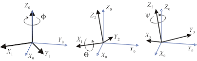
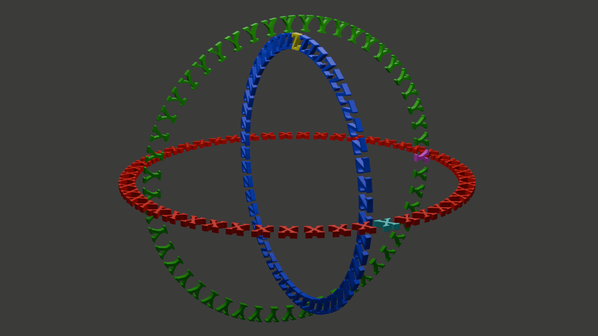

# I.Transsformation and rotation representation

In images, we can use equations to define the movement of points. But objects in animation are not just points; they have size, shape, and orientation.
We need a set of mathematical tools to describe changes in these properties, and that's where **geometric transformations** come in.

## 1.1.Basic Transformations and Homogeneous Coordinates

The most basic three-dimensional transformations include:
- Translate: 
$$
\mathbf{p'} = \mathbf{p}+\mathbf{T}
$$
- Scale:
$$
\mathbf{p'} = \mathbf{Sp}
$$
- Rotate: 
$$
\mathbf{p'} = \mathbf{Rp}
$$

Here, translation is addition, while scaling and rotation are multiplication, resulting in inconsistent forms. To unify them within the framework of matrix multiplication, we introduce **homogeneous coordinates**. We expand a three-dimensional point $(x,y,z)$ into a four-dimensional vector $[x,y,z,1]^T$.

In this way, all transformations can be represented by a $4\times 4$ matrix:
- Translation Matrix: 
$$
\begin{bmatrix}1&0&0&t_x \\ 0&1&0&t_y \\ 0&0&1&t_z \\ 0&0&0&1\end{bmatrix}
$$
- Scaling Matrix: 
$$
\begin{bmatrix}s_x&0&0&0\\0&s_y&0&0\\0&0&s_z&0\\0&0&0&1\end{bmatrix}
$$
- Rotating Matrix (Around the Z-axis): 
$$
\begin{bmatrix}\cos\theta&-\sin\theta&0&0\\\sin\theta&\cos\theta&0&0\\0&0&1&0\\0&0&0&1\end{bmatrix}
$$

The greatest advantage of using homogeneous coordinates in **concatenation of transformations** is that a series of complex transformations (e.g., scaling, rotation, and translation) can be precombined into a single composite transormation matrix:$\mathbf{M}=\mathbf{M}_{\text{translate}}\mathbf{M}_{\text{rotate}}\mathbf{M}_{\text{scale}}$. Then this $\mathbf{M}$ is used to transform all the vertices of the model, greatly improving efficiency.

Note: Matrix multiplication is not commutative; the order of transformations is crucial!

## 1.2.Challenges of Rotation Representation

Interpolation for translation and scaling is straightforward; it simply involves linear interpolation of the translation vector and the scaling factor.
However, interpolation for rotation is a very tricky problem.

**1.Rotation Matrix.**

The rotation matrix is a $3\times 3$ orthogonal matrix (the row and column vectors are all unit vectors and mutually orthogonal), with a determinant of 1.
- **Advantage**: It is mathematically rigorous and has no singularity.
- **Disadvantage**: **Redundancy**: Representing a rotation with only 3 degree of freedom using 9 numbers; **Interpolation difficulties**: Directly performing linear interpolation on the 9 elements of the two rotation matrices results in an intermediate matrix that is no longer orthogonal, which introduces unwanted scaling and skewing distortions.

Example: Rotate from $90^\circ$ to $-90^\circ$ around the Z-axis:

$$
 \mathbf{R}(90^\circ)=\begin{bmatrix}0&-1&0\\1&0&0\\0&0&1\end{bmatrix}\qquad \mathbf{R}(-90^\circ)=\begin{bmatrix}0&1&0\\-1&0&0\\0&0&1\end{bmatrix}
$$

Linear interpolation to half (weight 0.5):
$$
\mathbf{R}_{\text{half}}=0.5\mathbf{R}(90^\circ)+0.5\mathbf{R}(-90^\circ)=\begin{bmatrix}0&0&0\\0&0&0\\0&0&1\end{bmatrix}
$$
This is a strange matrix that flattens objects onto the Z-axis, which is not the $0^\circ$ rotation (identity matrix) we want!

**2.Euler Angles / Fixed Angles.**

This is the most intuitive representation. It decomposes any three-dimensional rotation into three consecutive rotations around three coordinate axes (e.g., X, Y, Z).
- Fixed Angle: Each rotation revolves around an axis of the world coordinate system.
- Euler angles: The first rotation is around the world coordinate axis, and subsequent rotations are around the axes of the object's own (local) coordinate system. An interesting property is that a rotation with Euler angles in the order of (X, Y, Z) is equivalent to a rotation with fixed angles in the order of (Z, Y, X). As showm below:

- Advantages: **Compact**: Uses only 3 numbers $(\theta_x, \theta_y, \theta_z)$; **Intuitive**: Easy for humans to understand and edit.
- Disadvantages: **Non-unique/non-uniform interpolation paths**: Linear interpolation of three angles often results in rotational paths that are not the shortest and have non-uniform angular velocities; **Gimbal Lock**: This is a fatal flaw of Euler angles. When the middle rotation axis (e.g., the Y-axis) rotates $90^\circ$, the first axis (X-axis) and the third axis (Z-axis) coincide. At this point, the system loses a rotational degree of freedom. Regardless of whether we change the angle of the X-axis or Z-axis, only rotation around the same world axis will occur. This leads to sudden, unnatural, rapid flips in animation.As showm below:


**3.Axis-Angle.**

According to Euler's rotation theorem, any three-dimensional rotation can be represented as rotating about an axis $\mathbf{a}$ in any direction by an angle $\theta$.
- Advantages: **Intuitive interpolation**: Rotation axes and rotation angles can be interpolated between two attitudes; **no gimbal lock-up**.
- Disadvantages: **Difficult to chain together**: Two axis-angle representations of rotation, the axes and angles of the composite rotation do not have simple calculation formulas; **Not unique representation**: $(\mathbf{a},\theta)$ and $(-\mathbf{a},-\theta)$ represent the same rotation.

## 1.3.Ultimate Solution: Quaternions

A quaternion is a mathematical concept created by the Irish mathematician William Nouwen Hamilton in 1843. It is usually denoted by $\mathbb {H}$.

From a definite perspective, a quaternion is a non-commutative extension of complex numbers. If the set of quaternions is considered as a multidimensional real number space, then a quaternion represents a four-dimensional space, while complex numbers represent a two-dimensional space.

As a coordinate representation for describing real space, quaternions were created based on complex numbers and are expressed in the form $a + bi + cj + dk$ to indicate the location of a point in space. $i$, $j$, and $k$ participate in operations as special imaginary units, and follow these operational rules: $i^2 = j^2 = k^2 = -1$.

The geometric meaning of $i$, $j$, and $k$ can be understood as a rotation. The $i$ rotation represents a rotation from the positive X-axis to the positive Y-axis in the plane where the X and Y axes intersect; the $j$ rotation represents a rotation from the positive Z-axis to the positive X-axis in the plane where the Z and X axes intersect; the $k$ rotation represents a rotation from the positive Y-axis to the positive Z-axis in the plane where the Y and Z axes intersect; and $-i$, $-j$, and $-k$ represent the opposite rotations of $i$, $j$, and $k$, respectively.

### 1.3.1.Definition

Quaternions are all composed of real numbers plus three elements $i,j,k$, and they have the following relationship:
$$
i^2=j^2=k^2=ijk=-1
$$

Each quaternion is a linear combination of $1,i,j,k$, and can generally be represented as $a+bi+cj+dk$.

To add two quaternions, simply add their similar coefficients, just like with complex numbers. The multiplication rule follows the multiplication table below:

$$
\begin{array}{c|cccc}
\times & 1 & i & j & k \\
\hline
1 & 1 & i & j & k \\
i & i & -1 & k & -j \\
j & j & -k & -1 & i \\
k & k & j & -i & -1 \\
\end{array}
$$

The multiplication of the identity elements of quaternions forms an 8th-order quaternion group, $Q_8$.

### 1.3.2.Property

Unlike real or complex numbers, quaternions do not obey the anticommutative law of multiplication and are therefore noncommutative, for example:
$$
ij=k, ji=-k\\
jk=i, kj=-i\\
ki=j, ik=-j
$$

Quaternions are an example of division rings. Except for the lack of a commutative property for multiplication, division rings are analogous to fields. Specifically, the associative property of multiplication still applies, and each non-zero element has a unique inverse.

Quaternions form a four-dimensional associative algebra (actually a division algebra) over real numbers, including complex numbers, but not forming an associative algebra with complex numbers. Quaternions (as well as real and complex numbers) are simply finite-dimensional associative division algebras of real numbers.

The noncommutativity of quaternions often leads to unexpected results. For example, an n-order polynomial of a quaternion can have more than $n$ distinct roots. For instance, the equation $h^2+1=0$ has infinitely many solutions. If any real number satisfies $b^2+c^2+d^2=1$, then $h = bi + cj + dk$ is a solution.

The conjugate of a quaternion $h = a + bi + cj + dk$ is defined as: 
$$
h^*=a-bi-cj-dk
$$

Its absolute value is a non-negative real number, defined as: 
$$
|h|=\sqrt{h\cdot h^*}=\sqrt{a^2+b^2+c^2+d^2}
$$

Note that $(hk)^*=k^*h^*$ is generally not equal to $h^*k^*$

The multiplicative inverse of a quaternion can be calculated using $h^{-1}=\frac{h^*}{|h|^2}$

By using the distance function $d(h,k)=|h-k|$, quaternions can become a metric space homeomorphic to $\mathbb{R}^4$ and have continuous arithmetic operations. Furthermore, for all quaternions $h$ and $k$, $|hk| = |h||k|$. Modulo the absolute value, quaternions can form a real Banach space.

### 1.3.3.Group Rotation

The conjugate action of the multiplicative group of nonzero quaternions on the part of $\mathbf{R}^3$ where the real part is zero can realize a rotation. The conjugate action of a unit quaternion (a quaternion with an absolute value of 1) with a real part of $\cos t$ is a rotation of angle $2t$, with the axis of rotation being the direction of the imaginary part. The advantages of quaternions are:
- The expression has no singularities (compared to representations such as Euler angles)
- It is more concise (and faster) than matrices
- A pair of unit quaternions can represent a rotation in four-dimensional space.

The set of all unit quaternions forms a three-dimensional sphere $S^3$ and a group (a Lie group) under multiplication. $S^3$ is a double superposition of the group $SO(3,R)$ of real orthogonal $3\times 3$ orthogonal matrices with determinant 1, since every two unit quaternions correspond to a rotation by the above relation. The group $S^3$ is isomorphic to $SU(2)$, which is the group of complex unitary $2\times 2$ matrices with determinant 1. Let $A$ be the set of quaternions of the form $a + bi + cj + dk$, where $a, b, c, d$ are either integers or rational numbers with odd numerators and denominators of 2. The set $A$ is a ring and a lattice. There are 24 quaternions in the ring, which are the vertices of a regular 24-cell structure with the Schleifli notation {3,4,3}.

### 1.3.4.Application

**Rotation using quaternions**: To rotate a 3D vector $\mathbf{p}$ using a unit quaternion $q$, first promote $\mathbf{p}$ to a pure quaternion $p=[0,\mathbf{p}]$, then perform the following operation:
$$
\mathbf{p'}=qpq^{-1}
$$

The scalar part of the result $\mathbf{p'}$ will be 0, and its vector part is the rotated vector.

Proof Summary: This multiplication is very complex after expansion, but its core idea is that the operation preserves the magnitude of the vector, and the scalar part of the final result is 0, therefore it is a pure rotation.

**Composite Rotation**: Rotating first with $q_1$, then with $q_2$, is equivalent to performing a rotation using the composite quaternion $q_{\text{comp}} = q_2q_1$. This is much simpler than serial axis-angle!

**Quaternion Interpolation**: **SLERP** The biggest advantage of quaternions is that they provide a smooth, singularity-free interpolation method. A unit quaternion can be viewed as a point on a unit hypersphere in four-dimensional space. Two orientations correspond to two points on the hypersphere.
- **Linear Interpolation (Lerp)**: Directly interpolating the four components of the quaternion linearly, then normalizing. Geometrically, this is equivalent to interpolating on a chord connecting two points, resulting in uneven speed.
- **Spherical Linear Interpolation (SLERP)**: This is the correct interpolation method. It performs uniform interpolation on a great circle connecting two points.

Given two unit quaternions $q_1, q_2$ and interpolation parameter $u\in[0,1]$, the SLERP formula is:
$$
\text{slerp}(q_1,q_2,u)=\frac{\sin(1-u)\Omega}{\sin\Omega}q_1+\frac{\sin u\Omega}{\sin\Omega}q_2
$$
where $\Omega=\arccos(q_1\cdot q_2)$ is the angle between the two quaternions in four-dimensional space.

**Practical Tip: "Shortest Path"** Since $q$ and $-q$ represent the same rotation, the interpolation from $q_1$ to $q_2$ has two paths (the shorter arc and the longer arc). We usually want to take the shortest path. This can be determined by checking the dot product $q_1\cdot q_2$. If $q_1\cdot q_2 < 0$, it means the angle is greater than 90 degrees, and we should interpolate to $-q_2$ instead of $q_2$ to ensure that the shorter arc is taken.

```cpp
// C++ Quaternion Slerp pseudocode
Quaternion Quaternion::slerp(const Quaternion& q1, const Quaternion& q2, float u) {
    Quaternion q2_temp = q2;
    float dot = q1.dot(q2);

    // If the dot product is negative, use the opposite of q2 to take the shortest path
    if (dot < 0.0f) {
        q2_temp = -q2;
        dot = -dot;
    }

    // Prevent the dot product from being slightly greater than 1 due to floating-point error
    if (dot > 0.9995f) {
        // Angle is very small, directly linearly interpolate and normalize to avoid division by 0
        return normalize(lerp(q1, q2_temp, u));
    }

    float theta_0 = acos(dot);        // Angle between q1 and q2
    float theta = theta_0 * u;        // Interpolated angle
    float sin_theta = sin(theta);
    float sin_theta_0 = sin(theta_0);

    float s1 = cos(theta) - dot * sin_theta / sin_theta_0;
    float s2 = sin_theta / sin_theta_0;

    return (q1 * s1) + (q2_temp * s2);
}
```

Conclusion: In animation systems, the common practice is as follows: externally, expose intuitive Euler angles to animators for editing; internally, convert Euler angles into quaternions for storage, interpolation, and computation; finally, when needed for application to vertices, convert the quaternions back to rotation matrices. Quaternions are the best standard for internally representing rotations!

# II.Keyframe interpolation and Velocity Control

## 2.1.The Philosophy of Motion Control in Animation

The core tasks of computer animation can be summarized into three levels:

- Representation of Motion: How to describe the motion state of an object using mathematical language (functions, parameters).
- Control and Editing of Motion: How to provide animators with convenient and intuitive tools so they can freely express their creative intentions.
- Generation of Motion: How to accurately calculate the motion parameters of each frame in the animation sequence based on the animator's settings.

Among these, keyframe animation is the most fundamental and important technique. Animators only need to define the state of a few "key" moments (such as position, direction, color, shape, etc.), and the computer is responsible for automatically "filling in" the intermediate processes. This "filling in" process is what we will discuss today: interpolation.

In modern animation software such as Maya or Blender, animators are not faced with dry numbers, but with an intuitive graph editor. Each curve represents the change of a parameter (such as translation in the X direction) over time. By editing the shape of these curves, animators can precisely control every detail of the movement.

## 2.2.The Core Problems of Keyframe Interpolation

Suppose we have a simple task: to position an object at point $(-5, 0, 0)$ in frame 22 and at point $(5, 0, 0)$ in frame 67. This seems simple, but to create expressive animation, we must answer several key questions:

1.What interpolation function should we use? Simple linear motion or smooth curved motion?

2.How do we parameterize the function? How do we map "time" onto the motion path?

3.How do we control the motion rhythm? For example, we want the object to first be stationary, then accelerate, reach maximum speed midway, then decelerate, and finally stop precisely in frame 67.

A poor interpolation can produce unnatural effects. For example, a bouncing ball, if improperly interpolated, might "pass through" the ground upon landing before bouncing again, instead of forming a smooth bounce.

Our solution consists of two steps:

1.**Generating a Space Curve**: First, define the geometric path of the object's motion using a smooth mathematical curve.

2.**Speed ​​Control**: Then, define a function to describe how fast the object moves along this path.

## 2.3.Spline Curve

To generate smooth motion paths, we use a mathematical tool called a spline. A spline is essentially a piecewise polynomial, formed by splicing together many low-order polynomial curve segments.

**Why choose piecewise cubic polynomials?**

- Below cubic? Quadratic polynomials (parabolas) lack inflection points, have a simple shape, and are difficult to fit complex shapes.
- Above cubic? While higher-order polynomials are more flexible, they are prone to unwanted fluctuations and oscillations (known as the Runge phenomenon) and are computationally more expensive.
- Cubic polynomials strike the perfect balance: they are simple enough and computationally efficient; yet flexible enough to have inflection points, satisfying our constraints on position and tangents, thus ensuring the smoothness of connections between curve segments.

**The concept of continuity**

When splicing curve segments together, the smoothness of the connection points is crucial. We describe continuity using different orders:

- **$C^0$ Continuity (Positional Continuity)**: Curve segments connect at the junction without interruption. This is the most basic requirement.
- **$C^1$ Continuity (Tangential Continuity)**: At the junction, the two curve segments not only have the same position, but their tangent directions and magnitudes are also the same (i.e., the first derivative is the same). This ensures a smooth transition in the direction of motion, without sharp turns. For most animation applications, $C^1$ continuity is sufficient.
- **$C^2$ Continuity (Curvature Continuity)**: At the junction, the curvature of the curves is also the same (i.e., the second derivative is the same). This ensures a smooth change in acceleration, which is crucial for simulating camera paths in high-speed motion (such as roller coasters).

Next, we will delve into some of the most important and classic cubic spline curves.

### 2.3.1.Hermite Spline

Hermitian splines are a very basic and powerful type of interpolation spline. To define a Hermitian curve segment, we need four geometric constraints:

- Starting point position $\mathbf{P_0}$
- Ending point position $\mathbf{P_1}$
- Starting point tangent vector $\mathbf{P_0'}$
- Ending point tangent vector $\mathbf{P_1'}$

Mathematical Derivation Our goal is to find a cubic polynomial vector function $\mathbf{P}(u)=\mathbf{a}u^3+\mathbf{b}u^2+\mathbf{c}u+\mathbf{d}$ with parameters in the range $u \in [0, 1]$, satisfying the four conditions mentioned above.

Here, $\mathbf{P}(u)$ is a three-dimensional vector $(P_x(u), P_y(u), P_z(u))$, and the coefficients $\mathbf{a}, \mathbf{b}, \mathbf{c}, \mathbf{d}$ are also three-dimensional vectors. We can derive the function independently for each component $(x, y, z)$. Taking the $x$-component as an example:
$$
P_x(u)=a_xu^3+b_xu^2+c_xu+d_x
$$

Its first derivative (the x-component of the tangent vector) is:
$$
P_x'(u)=3a_xu^2+2b_xu+c_x
$$

We substitute the four constraints:
1. $P_x(0)=d_x=P_{0x}$
2. $P_x(1)=a_x+b_x+c_x+d_x=P_{1x}$
3. $P_x'(0)=c_x$
4. $P_x'(1)=3a_x+2b_x+c_x$

We have obtained a system of four linear equations with unknown coefficients $(a_x,b_x,c_x,d_x)$. Solving this system of equations, we get:
$$
d_x=P_x(0)\\
c_x=P'_x(0)\\
a_x=2(P_x(0)-P_x(1))+P_x'(0)+P_x'(1)\\
b_x=3(P_x(1)-P_x(0))-2P_x'(0)-P_x'(1)
$$

Substituting the solved coefficients back into the original polynomial yields a more elegant matrix form:
$$
\mathbf{P}(u)=\begin{bmatrix}u^3&u^2&u&1\end{bmatrix}\begin{bmatrix}2&-2&1&1\\
-3&3&-2&-1\\0&0&1&0\\1&0&0&0\end{bmatrix}\begin{bmatrix}\mathbf{P_0}\\\mathbf{P_1}\\\mathbf{P_0'}\\\mathbf{P_1'}\end{bmatrix}
$$

This formula can be simplified to $\mathbf{P}(u)=\mathbf{U}^T\mathbf{M}_H\mathbf{B}_H$, where:
- $\mathbf{U}^T=\begin{bmatrix}u^3&u^2&u&1\end{bmatrix}$ is the parameter vector.
- $\mathbf{M}_H$ is the Hermite Basis Matrix.
- $\mathbf{B}_H$ is the geometric constraint vector.

Blending Functions: If we further expand the matrix and write $\mathbf{P}(u)$ as a linear combination of geometric constraints, we obtain:
$$
\mathbf{P}(u)=(2u^3-3u^2+1)\mathbf{P_0}+(-2u^3+3u^2)\mathbf{P_1}+(u^3-2u^2+u)\mathbf{P_0'}+(u^3-u^2)\mathbf{P_1'}
$$

The four polynomials in $u$ here are Hermitian mixture functions. They act like "weights," determining how much each of the four geometric constraints (two points and two tangent vectors) contributes to the final position at parameter $u$.

How to splice them? To create a long, smooth composite Hermitian curve, we simply use the endpoint $\mathbf{P_1}$ and the endpoint tangent vector $\mathbf{P_1'}$ of the previous segment as the starting point $\mathbf{P_0}$ and the starting point tangent vector $\mathbf{P_0'}$ of the next segment. This automatically ensures the continuity of $C^1$.

### 2.3.2.Bézier Curve

* The curve **passes** through the starting point $\mathbf{P}_0$ and the ending point $\mathbf{P}_3$.

* The two intermediate points $\mathbf{P}_1, \mathbf{P}_2$ are not on the curve, but rather act like "magnets," **attracting** the curve and defining its shape.

* The initial tangent vector is determined by $\vec{\mathbf{P}_0 \mathbf{P}_1}$, and the ending tangent vector is determined by $\vec{\mathbf{P}_2 \mathbf{P}_3}$.

**Relationship with Hermitian Curves** A Bézier curve can be viewed as a special form of a Hermitian curve, with the following geometric constraints:

* Starting point: $\mathbf{P}_0$
* Ending point: $\mathbf{P}_3$
* Starting tangent vector: $3(\mathbf{P}_1 - \mathbf{P}_0)$
* Ending tangent vector: $3(\mathbf{P}_3 - \mathbf{P}_2)$

Substituting these into Hermitian matrix form, we can derive the basis matrix $\mathbf{M}\_B$ of the Bézier curve: 
$$
\mathbf{P}(u) = \begin{bmatrix} u^3 & u^2 & u & 1 \end{bmatrix} \begin{bmatrix} -1 & 3 & -3 & 1 \\ 3 & -6 & 3 & 0 \\ -3 & 3 & 0 & 0 \\ 1 & 0 & 0 & 0 \end{bmatrix} \begin{bmatrix} \mathbf{P}_0 \\ \mathbf{P}_1 \\ \mathbf{P}_2 \\ \mathbf{P}_3 \end{bmatrix}
$$

**Bernstein Polynomials** Bézier curves can also be defined in a more classic and geometrically meaningful way, using Bernstein polynomials as mixing functions: 
$$
\mathbf{P}(u) = \sum_{k=0}^{n} B_{k,n}(u) \mathbf{P}_k
$$
where $B_{k,n}(u) = C(n,k) u^k (1-u)^{n-k}$ are Bernstein basis functions, and $C(n,k) = \frac{n!}{k!(n-k)!}$ are the binomial coefficients. For a cubic Bézier curve ($n=3$), the formula expands to: 
$$
\mathbf{P}(u) = (1-u)^3 \mathbf{P}_0 + 3u(1-u)^2 \mathbf{P}_1 + 3u^2(1-u) \mathbf{P}_2 + u^3 \mathbf{P}_3
$$

**De Casteljau's Algorithm** This is a very elegant method for calculating the geometric construction of any point on a Bézier curve. Its core is **recursive linear interpolation**. To calculate the point $\mathbf{P}(u)$ corresponding to parameter $u$:

1. On each control edge $\mathbf{P}_k \mathbf{P}_{k+1}$, find the point interpolated proportionally to $u$.
2. Connect these new points to form new line segments.
3. On these new line segments, interpolate again proportionally to $u$.
4. Repeat this process until only one point remains, which is $\mathbf{P}(u)$.

**Global Control** A characteristic of Bézier curves is that moving any control point changes the shape of the entire curve. This property is called global control.

#### **2.3.3 Catmull-Rom Spline**

Animators usually want the curve to **pass through** all the key points they specify. Hermite requires specifying tangent vectors, and Bézier only passes through the start and end points. Catmull-Rom spline solves this problem. It is an **interpolation spline** that automatically calculates the tangent vectors of each internal key point, ensuring that the entire curve is C¹ continuous.

*   Given a series of control points $\mathbf{P}_{i-1}, \mathbf{P}_i, \mathbf{P}_{i+1}, \mathbf{P}_{i+2}$.
*   The curve segment between $\mathbf{P}_i$ and $\mathbf{P}_{i+1}$ is jointly determined by these four points.
*   The tangent vector at point $\mathbf{P}_i$ is cleverly defined as the vector in the direction of the line connecting its two adjacent points $\mathbf{P}_{i-1}$ and $\mathbf{P}_{i+1}$: $\mathbf{P}'_i = s(\mathbf{P}_{i+1} - \mathbf{P}_{i-1})$, where $s$ is a "tension" parameter, usually taken as $1/2$.

Thus, we have the **position** (from the input) and **tangent vector** (automatically calculated) for each point, and we can directly use the framework of Hermitian splines to construct each curve segment. This provides great convenience for animators.

**Local Control** Unlike Bézier curves, Catmull-Rom splines have local control. Moving a control point $\mathbf{P}_i$ only affects the adjacent curve segments, and the distant curve is not affected.

### **2.4 Speed Control: Arc Length Parameterization**

We have created a smooth motion path $\mathbf{P}(u)$, but there is still a problem: when the parameter $u$ changes **uniformly** (for example, from 0 to 1), the speed of the object moving in space **is not necessarily uniform**. Where the curve bends sharply, the object's speed will slow down; where the curve is gentle, the speed will increase.

To achieve precise speed control, we must decouple the geometric path and the motion speed. This requires introducing the concept of **Arc Length**.

**Arc Length Function $s(u)$** is defined as the path length from the start of the curve to the parameter $u$: 
$$
s(u) = \int_0^u | \mathbf{P}'(t) | \,dt
$$
where $| \mathbf{P}'(t) |$ is the magnitude of the velocity vector at parameter $t$, i.e., the speed.

The goal of **Arc-Length Reparameterization** is to find a new parameterization function $\mathbf{P}^*(s)$ such that when the new parameter $s$ (arc length) increases at a constant speed, the object moves at a constant speed in space. This process consists of two steps:
1. Calculate the arc length function $s = S(u)$.
2. Calculate its inverse function $u = S^{-1}(s) = U(s)$.
3. Obtain the new curve equation $\mathbf{P}^*(s) = \mathbf{P}(U(s))$.

**Practical Application: Numerical Methods** For complex spline curves, the arc length integral usually does not have an analytical solution. Therefore, we use numerical methods, the most common being **Forward Differencing**:

1. **Pre-computation**: Perform dense sampling (e.g., 1000 points) within the range of the curve parameter $u$ from 0 to 1. 2. **Construct a lookup table**: Calculate the cumulative arc length from each sampling point to the starting point and store it in a lookup table `[u, arc_length]`.

```cpp
struct ArcLengthTableEntry {
    float u;
    float arc_length;
};

std::vector<ArcLengthTableEntry> build_arc_length_table(const Spline& curve, int num_samples) {
    std::vector<ArcLengthTableEntry> table;
    table.push_back({0.0f, 0.0f});

    glm::vec3 prev_point = curve.get_point(0.0f);
    float accumulated_length = 0.0f;

    for (int i = 1; i <= num_samples; ++i) {
        float u = (float)i / num_samples;
        glm::vec3 current_point = curve.get_point(u);
        accumulated_length += glm::distance(current_point, prev_point);
        table.push_back({u, accumulated_length});
        prev_point = current_point;
    }
    return table;
}
```

With this table, we can perform bidirectional queries:

* **Given u, find s:** Directly search or interpolate in the table.
* **Given s, find u:** Perform a binary or linear search in the `arc_length` column of the table to find the corresponding $u$.

**Speed ​​Curve** Now, we can introduce the final control tool—the speed control curve. This is a 2D function $s = S_{\text{control}}(t)$, which maps the normalized **time** $t \in [0,1]$ to the normalized **arc length** $s \in [0,1]$.

* **Uniform Motion**: $S_{\text{control}}(t) = t$, which is a straight line.
* **Ease-in/Ease-out**: $S_{\text{control}}(t)$ is an S-shaped curve. It has a small slope at the beginning and end (slow speed), and a large slope in the middle (fast speed). This produces a very natural and smooth acceleration and deceleration effect.

**Final Animation Generation Process** For any given time $t_{\text{current}}$ (within the total time $T_{\text{total}}$):

1. Calculate the normalized time $t = t_{\text{current}} / T_{\text{total}}$.
2. Obtain the normalized target arc length $s = S_{\text{control}}(t)$ using the speed control curve.
3. Multiply $s$ by the total arc length $L_{\text{total}}$ to obtain the actual target arc length $s_{\text{actual}}$.
4. Look up the curve parameter $u$ corresponding to $s_{\text{actual}}$ in the pre-calculated arc length table.
5. Use this $u$ to calculate the final position of the object on the space curve $\mathbf{P}(u)$.

# Conclusion

In this lecture, we have explored the essential mathematical tools that underpin modern computer animation, from geometric transformations and rotation representations to keyframe interpolation and velocity control. By introducing homogeneous coordinates, we established a unified framework for combining translation, scaling, and rotation into efficient matrix operations. We then examined the limitations of traditional rotation representations and demonstrated how quaternions provide a robust, compact, and interpolation-friendly solution for handling orientation in three-dimensional space.

On the motion generation side, we analyzed how spline curves such as Hermite, Bézier, and Catmull–Rom splines enable the construction of smooth and controllable trajectories, satisfying important continuity constraints. Furthermore, through arc-length parameterization and speed control curves, we showed how to decouple geometric paths from temporal behavior, allowing animators to precisely shape acceleration and deceleration patterns.

Together, these techniques form the theoretical and practical foundation of keyframe-based animation systems. By combining intuitive external controls with mathematically rigorous internal representations, modern animation pipelines can achieve both artistic flexibility and computational efficiency. Mastery of these principles is essential for designing reliable, expressive, and scalable animation systems in real-world applications.