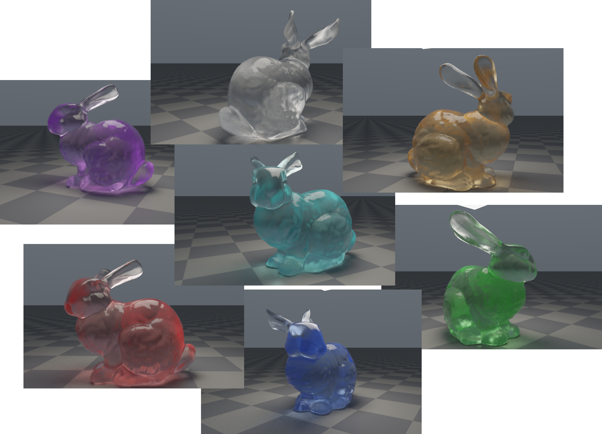

The source cuda code can be found [here](codes/glassbunny.cu), which you should noted is that the stb_image.h, stb_image_write.h and the stanford-bunny.obj must be placed at the same file level.

## 1. Rendering Equation

### 1.1 Radiance and Solid Angle

- Radiance $L(x, \omega)$: the energy density at point $x$ along direction $\omega$, and the most fundamental quantity in rendering.
- Hemispherical integration domain: the hemisphere above the surface normal $n$, denoted $H^2(n)$.
- Cosine term: $\cos\theta = n\cdot\omega_i$, representing projected-area foreshortening due to the angle between incident direction and normal.

### 1.2 Surface Rendering Equation (Kajiya)

A common form for opaque surfaces is:

$$
L_o(x,\omega_o)=L_e(x,\omega_o)+\int_{H^2(n)} f_s(x,\omega_i,\omega_o)\,L_i(x,\omega_i)\,|n\cdot\omega_i|\,d\omega_i
$$

Where:

- $L_o$: outgoing radiance
- $L_e$: emitted radiance
- $f_s$: BSDF (a unified form covering BRDF/BTDF)
- $L_i$: incident radiance (recursively contributed by other scene points)

The challenge for glass is that $f_s$ contains both reflection and transmission, and ideal glass is delta-distributed, so it cannot be handled directly with ordinary continuous PDFs.

## 2. Interface Physics of Liuli (Dielectric Glass)

Glass is usually modeled as a non-conductive dielectric. At the interface, three events may occur:

1. Fresnel reflection
2. Refraction (Snell)
3. Possible total internal reflection (TIR)

### 2.1 Snell's Law

$$
\eta_i \sin\theta_i=\eta_t \sin\theta_t
$$

- $\eta_i$: index of refraction on incident side (air is about 1.0)
- $\eta_t$: index of refraction on transmitted side (glass is commonly 1.45~1.55)

### 2.2 Fresnel Term

Exact dielectric Fresnel (parallel/perpendicular polarization):

$$
F = \frac{1}{2}\left[\left(\frac{\eta_t\cos\theta_i-\eta_i\cos\theta_t}{\eta_t\cos\theta_i+\eta_i\cos\theta_t}\right)^2+
\left(\frac{\eta_i\cos\theta_i-\eta_t\cos\theta_t}{\eta_i\cos\theta_i+\eta_t\cos\theta_t}\right)^2\right]
$$

In practice, Schlick's approximation is widely used:

$$
F(\cos\theta)\approx F_0+(1-F_0)(1-\cos\theta)^5,\quad
F_0=\left(\frac{\eta_i-\eta_t}{\eta_i+\eta_t}\right)^2
$$

### 2.3 Total Internal Reflection

When traveling from a higher IOR medium to a lower one, if the refraction angle has no real solution, then $F=1$ and only reflection remains.

## 3. Glass "Color" Comes from Volumetric Absorption: Beer-Lambert

Ideally, non-absorbing glass is effectively colorless. Colored liuli comes from the medium absorption coefficient $\sigma_a$ (per RGB channel):

$$
T(d)=\exp(-\sigma_a d)
$$

- $d$: geometric distance traveled by light inside glass
- $T(d)$: transmittance (per channel)

In path tracing, whenever "the previous segment is inside glass," multiply throughput by $\exp(-\sigma_a \cdot t_{hit})$.

This is why $\sigma_a$ controls glass tint strength in many implementations.

## 4. Liuli BSDF: From Ideal to Rough

### 4.1 Ideal Smooth Glass (Specular Delta)

An ideal interface has only two discrete directions:

- Specular reflection direction $\omega_r$
- Refraction direction $\omega_t$

It can be written in delta form (schematically):

$$
f(\omega_i,\omega_o)=F\,\delta(\omega_i-\omega_r)+ (1-F)\,\delta(\omega_i-\omega_t)\cdot J
$$

$J$ is the measure-conversion term for transmission (related to $\eta$). In many practical implementations, this is absorbed via event sampling probability + throughput update.

Corresponding sampling:

- Sample reflection with probability $F$
- Sample transmission with probability $1-F$
- Under TIR, force reflection

### 4.2 Rough Glass

Real liuli surfaces have microstructure, so microfacet models are used:

- Normal distribution function $D(m)$ (commonly GGX/Beckmann)
- Geometric masking-shadowing term $G$
- Fresnel term $F$

Rough glass includes:

1. Microfacet reflection BRDF
2. Microfacet transmission BTDF

Characteristics:

- Highlights/caustics become more diffuse instead of razor sharp
- Noise convergence strongly depends on the sampling strategy (BSDF-only sampling is often still noisy)

## 5. Decomposing Lighting Integral: Direct + Indirect

Split the rendering equation into:

$$
L_o = L_e + L_{direct} + L_{indirect}
$$

- $L_{direct}$: direct contribution from visible light sources at current point (can use NEE)
- $L_{indirect}$: recursive bounce contribution

For glass scenes, relying only on "randomly bouncing into light" is very noisy, especially with small area lights and caustic paths. So typically:

1. Perform NEE on diffuse / non-delta vertices
2. Use MIS to combine BSDF sampling and light sampling

## 6. Path Tracing Estimator (Monte Carlo)

Let path throughput be $\beta$. Update at each hit $x_k$:

$$
\beta \leftarrow \beta \cdot \frac{f_s(\omega_i,\omega_o)\,|n\cdot\omega_i|}{p(\omega_i)}
$$

If inside glass, also apply absorption:

$$
\beta \leftarrow \beta \cdot \exp(-\sigma_a d)
$$

Final pixel estimate:

$$
\hat{L}=\frac{1}{N}\sum_{s=1}^{N}\sum_{k} \beta_k\,L_{emit/env}
$$

## 7. NEE (Next Event Estimation)

At current point $x$, sample light point $y$ directly:

$$
L_{direct}\approx \frac{f_s(x,\omega_i,\omega_o)\,L_e(y,-\omega_i)\,G(x,y)\,V(x,y)}{p_{light}(y)}
$$

Where:

- $G(x,y)=\frac{|n_x\cdot\omega_i|\,|n_y\cdot(-\omega_i)|}{\|x-y\|^2}$
- $V(x,y)$ is visibility (shadow ray)
- If an area light is sampled in area measure first, convert area PDF to solid-angle PDF:

$$
p_\omega = p_A \frac{\|x-y\|^2}{|n_y\cdot(-\omega_i)|}
$$

## 8. MIS (Multiple Importance Sampling)

When the same integral can be estimated by two strategies (light sampling / BSDF sampling), MIS reduces variance.

Common Power Heuristic:

$$
w_a = \frac{p_a^2}{p_a^2+p_b^2},\quad
w_b = \frac{p_b^2}{p_a^2+p_b^2}
$$

Then:

- Multiply light-sampling contribution by $w_{light}$
- Multiply BSDF-hit-light contribution by $w_{bsdf}$

This is more stable when lights are small, BSDFs are sharp, or both are complex.

## 9. Russian Roulette (Unbiased Path Termination)

Deep paths are expensive, so after bounce >= 3 a survival test is usually applied:

$$
p_{survive}=\min(\max(\beta), p_{max})
$$

- If terminated: break
- If survived: $\beta /= p_{survive}$

This keeps the estimator unbiased while significantly reducing average path length.

## 10. Engineering-Level Denoising

Glass + area light often produces high-frequency bright speckle noise (fireflies). Common combinations:

1. Physics-level variance reduction  
- NEE + MIS  
- Better BSDF/light sampling  
- Higher spp while camera is still

2. Statistical denoising  
- Firefly clamp (limit extreme samples)  
- Joint bilateral / temporal accumulation / A-Trous

3. Perceptual post-process  
- Perform filtering in HDR domain before tonemapping to avoid color shift

Note: clamping introduces slight bias, but greatly improves usability and is common in interactive preview.

## 11. Practical Parameter Ranges (Liuli)

- $ior$: 1.45~1.55 (typical glass)
- $\sigma_a$: 0~2 (depends on model scale)
- $\text{roughness}$: 0.02~0.15 (common micro-frosted liuli range)
- $\text{max\_bounces}$: 8~12
- $\text{spp\_per\_frame}$: higher when camera is still, lower while moving

If model scale changes significantly, recalibrate $\sigma_a$ first, otherwise color can become too strong or too weak.
