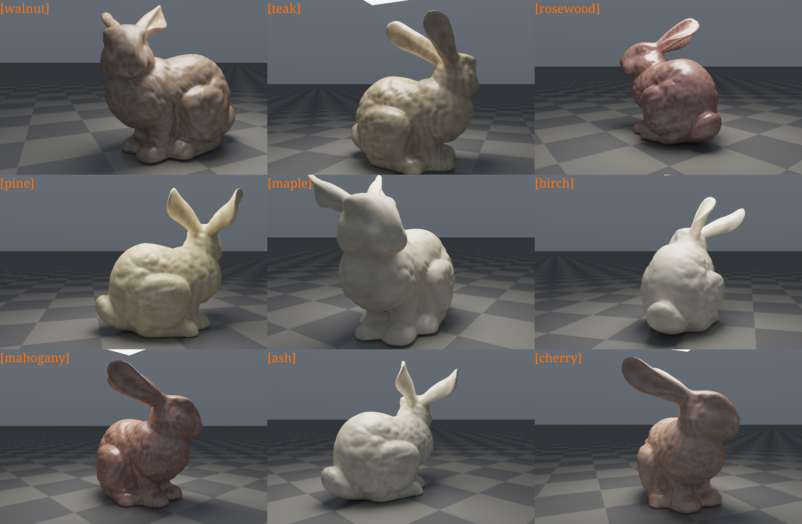

The source cuda code can be found [here](https://github.com/forliage/forliage.github.io/blob/main/src/pages/showcase/_data/codes/woodbunny.cu), which you should noted is that the **stb_image.h**, **stb_image_write.h** and the **stanford-bunny.obj** must be placed at the same file level.


## 1. Basic Rendering Equation

For any surface point $x$ and view direction $\omega_o$, we use the standard surface rendering equation:

$$
L_o(x,\omega_o)=L_e(x,\omega_o)+\int_{H^2(n)} f_s(x,\omega_i,\omega_o)\,L_i(x,\omega_i)\,|n\cdot\omega_i|\,d\omega_i
$$

Where:

- $L_o$: outgoing radiance
- $L_e$: emitted radiance (only for light sources)
- $f_s$: surface BSDF (both wood and ground are non-delta)
- $L_i$: incident radiance

In this implementation, both the bunny and the ground are non-specular-delta materials, so both can use NEE + MIS.

## 2. Wood Material Model

`woodbunny.cu` uses an empirical model: “procedural texture + diffuse + clear-coat-like specular”:

$$
f_{wood}=k_d\cdot\frac{\rho_{wood}(x)}{\pi}+k_s\cdot f_{spec}
$$

And:

$$
k_d=1-k_s,\quad k_s=\text{bunny\_spec\_strength}
$$

The specular term $f_{spec}$ uses a power-cosine (Phong-like) form, with exponent mapped from roughness.

## 3. Procedural Wood Grain $\rho_\text{wood}(x)$

### 3.1 Multi-frequency Noise (FBM)

FBM is built by summing value noise:

$$
\text{fbm}(p)=\sum_{o=0}^{N-1} a_o\,n(2^o p)
$$

Used for:

- Coordinate warping
- Long-direction grain details
- Pore darkening mask

### 3.2 Ring and Grain Fusion

The main wood pattern comes from “radial rings + perturbation”:

$$
r=\sqrt{x_w^2+z_w^2},\quad
\text{ring}=0.5+0.5\sin(2\pi\cdot(r\cdot s_{ring}+w\cdot a_{ring}))
$$

Then it is combined with longitudinal grain and streak into a blend factor $t$:

$$
t=0.58\,\text{ring}+0.32\,\text{grain}+0.10\,\text{streak}
$$

The final color is obtained by interpolating between light and dark tones:

$$
\rho_{wood}(x)=\text{lerp}(C_{dark},C_{light},t)
$$

And pore darkening is applied:

$$
\rho_{wood}\leftarrow \rho_{wood}\cdot\left(1-s_{pore}\cdot m_{pore}\right)
$$

## 4. Direct Lighting Estimation: NEE

For the rectangular area light $A$, next-event estimation is used:

$$
L_{direct}\approx
\frac{f_s(x,\omega_i,\omega_o)\,L_e(y,-\omega_i)\,|n_x\cdot\omega_i|\,|n_y\cdot(-\omega_i)|}
{\|x-y\|^2\,p_A(y)}\cdot V(x,y)
$$

Where $V(x,y)$ is visibility evaluated by a shadow ray.

## 5. MIS (Light Sampling + BSDF Sampling)

The implementation uses the power heuristic:

$$
w_a=\frac{p_a^2}{p_a^2+p_b^2}
$$

- Multiply light-sampling contribution by $w_\text{light}$
- Multiply BSDF-path-hit-light contribution by $w_\text{bsdf}$

This is more stable under small area lights + rough highlights, and significantly less noisy than a single strategy.


## 6. Path Throughput Update

At each bounce:

```math
\beta \leftarrow \beta\cdot\frac{f_s\,|n\cdot\omega_i|}{p(\omega_i)}
```

After a certain depth, apply Russian Roulette:

```math
p_{survive}=\min(\max(\beta),0.98)
```

This keeps the estimator unbiased while controlling computation cost.
## 7. Firefly Suppression and Denoising

### 7.1 Firefly Clamp

Apply soft clamping to overly bright sample radiance to suppress high-frequency bright speckles:

$$
L \leftarrow L\cdot\frac{L_{max}}{\max(L)}\quad (\max(L)>L_{max})
$$

### 7.2 Post-process Denoising (HDR Joint Bilateral)

In `tonemap_ui_kernel`, perform HDR-domain joint bilateral filtering before tonemap/gamma:

- Spatial weight: based on neighborhood distance
- Color weight: based on HDR difference and adaptive to spp

This significantly reduces noise while preserving wood-grain boundaries.

