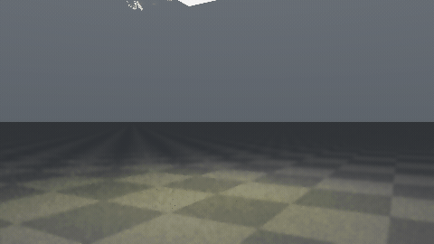
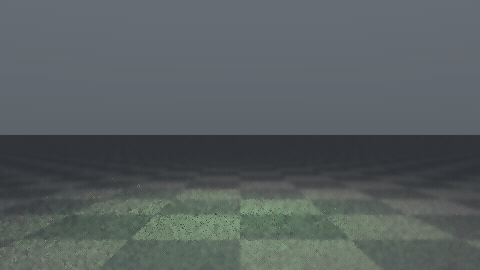

|Strawberry|Lemon|Lime|
|---|---|---|
||||

The source cuda code can be found [here](https://github.com/forliage/forliage.github.io/blob/main/src/pages/showcase/_data/codes/jellybunny.cu),  which you should noted is that the stb_image.h, stb_image_write.h and the stanford-bunny.obj must be placed at the same file level.

It's important to note that running this program on an RTX 4060 is not fast. The red image (red, the strawberry-flavored jelly rabbit) has a quality scale of 2.0 and took approximately 2 hours; the green image (green, the lime-flavored jelly rabbit) has a quality scale of 0.5 and took approximately 45 minutes. It's clear that the bottom image has significantly more noise than the top. In addition, I've provided jelly rabbits in Clear, Orange, Lemon, Blueberry, Grape, and Peach flavors. Due to computational limitations, I'm only providing two .gif files for demonstration purposes; readers are welcome to obtain the other beautiful jelly rabbits themselves. **Furthermore, if you have better methods or ideas for noise reduction and speeding up the process, please contact me at [masterforliage@gmail.com](mailto:masterforliage@gmail.com).**

## 1. Rendering Equation

### 1.1 Radiance and Surface Integral

For a shading point $x$ and outgoing direction $\omega_o$, the surface form is:

$$
L_o(x,\omega_o)=L_e(x,\omega_o)+\int_{H^2(n)} f_s(x,\omega_i,\omega_o)\,L_i(x,\omega_i)\,|n\cdot\omega_i|\,d\omega_i
$$

Where:

- $L_o$: outgoing radiance
- $L_e$: emitted radiance (area light only)
- $f_s$: BSDF (ground BRDF or jelly interface BSDF)
- $L_i$: incident radiance from recursive transport

### 1.2 Jelly-Specific Transport Split

In this implementation, radiance transport is a combination of:

1. Surface events (ground BRDF and dielectric reflection/refraction)
2. Medium attenuation/scattering when path segments are inside jelly
3. Direct-light sampling on non-delta surfaces with MIS

## 2. Dielectric Interface Model for Jelly

The bunny surface is treated as rough dielectric.

### 2.1 Snell + Fresnel

Snell:

$$
\eta_i\sin\theta_i=\eta_t\sin\theta_t
$$

Schlick approximation:

$$
F(\cos\theta)\approx F_0+(1-F_0)(1-\cos\theta)^5,\quad
F_0=\left(\frac{\eta_i-\eta_t}{\eta_i+\eta_t}\right)^2
$$

Sampling rule:

- Reflect with probability $F$
- Refract with probability $1-F$
- On TIR, force reflection

### 2.2 Rough Interface Sampling

For non-zero roughness, reflection/transmission directions are perturbed around ideal axes by a power-cosine lobe:

$$
p(\omega)\propto \cos^k\theta,\quad
k=\frac{2}{r^2}-2
$$

Where $r$ is roughness and $k$ is the mapped exponent.

## 3. Participating Medium Inside Jelly

Jelly color comes from absorption + weak scattering in the interior.

### 3.1 Beer-Lambert Attenuation

$$
\sigma_t=\sigma_a+\sigma_s,\quad
T(d)=\exp(-\sigma_t d)
$$

Whenever the path is inside jelly:

$$
\beta \leftarrow \beta \cdot T(d)
$$

### 3.2 Weak In-Scatter Approximation (Engineering Term)

The implementation adds a controlled in-scatter term:

$$
L_{scatter}\approx \rho_s \cdot \Big(0.30\,L_{env}+0.04\,L_{light}\Big)\cdot s(d,g)
$$

Where:

- $\rho_s=\sigma_s/\sigma_t$ (per channel)
- $s(d,g)$ uses transmittance loss and anisotropy factor $g$
- This is variance-friendly and keeps a translucent jelly look without full volumetric random walks

## 4. Ground BRDF Model

Ground uses a mixed diffuse + glossy model:

$$
f_{ground}=k_d\frac{\rho_{ground}(x)}{\pi}+k_s f_{spec}
$$

Current constants:

- $k_d=0.72$
- $k_s=0.28$

Ground albedo is checker-like and distance-faded to stabilize composition under motion.

## 5. Next Event Estimation (NEE)

At ground hits, direct light from rectangular area light is sampled:

$$
L_{direct}\approx
\frac{f_s(x,\omega_i,\omega_o)\,L_e(y,-\omega_i)\,|n_x\cdot\omega_i|\,|n_y\cdot(-\omega_i)|}
{\|x-y\|^2\,p_A(y)}\cdot V(x,y)
$$

And area-measure PDF is converted to solid-angle PDF:

$$
p_\omega=p_A\frac{\|x-y\|^2}{|n_y\cdot(-\omega_i)|}
$$

## 6. MIS (Light Sampling + BSDF Sampling)

Power heuristic:

$$
w_a=\frac{p_a^2}{p_a^2+p_b^2}
$$

Used for:

- NEE contribution at diffuse/glossy surfaces
- BSDF-sampled paths that hit the light

This reduces variance under small area light + rough dielectric transport.

## 7. Path Throughput, RR, and Clamp

At each non-delta surface event:

$$
\beta \leftarrow \beta \cdot \frac{f_s\,|n\cdot\omega_i|}{p(\omega_i)}
$$

Russian roulette after several bounces:

$$
p_{survive}=\min(\max(\beta),0.98)
$$

If survived, divide throughput by $p_{survive}$ to keep unbiasedness.

A firefly clamp is also applied to sample radiance:

$$
L \leftarrow L\cdot\frac{L_{max}}{\max(L)}\quad (\max(L)>L_{max})
$$

## 8. Denoising and Tonemap Pipeline

### 8.1 In-Kernel HDR Joint Bilateral

Before tonemap/gamma, an HDR bilateral-like filter is applied with:

- Spatial term (neighborhood distance)
- Color term (HDR difference, adaptive to spp)

### 8.2 Offline Temporal + Spatial Stabilization

Before GIF encoding, frame sequence is filtered by:

1. Temporal neighbor blending with thresholds
2. Spatial edge-aware smoothing

Then frames are encoded using palette-based GIF pipeline.

## 9. Soft-Body Dynamics (XPBD) for Drop and Impact Wobble

The bunny motion is simulated with XPBD edge constraints + shape constraint.

### 9.1 Edge Constraint

For an edge $(i,j)$:

$$
C(\mathbf{x})=\|\mathbf{x}_j-\mathbf{x}_i\|-l_0
$$

XPBD lambda update:

$$
\Delta\lambda=\frac{-C-\alpha\lambda}{w_i+w_j+\alpha},\quad
\alpha=\frac{c}{\Delta t^2}
$$

Position corrections:

$$
\mathbf{x}_i \leftarrow \mathbf{x}_i-w_i\Delta\lambda\nabla C,\quad
\mathbf{x}_j \leftarrow \mathbf{x}_j+w_j\Delta\lambda\nabla C
$$

### 9.2 Shape-Preserving Constraint with Translation

Each vertex is softly pulled toward translated rest pose:

$$
\mathbf{x}_i^{target}=\mathbf{x}_i^{rest}+\mathbf{c}_{offset}
$$

This preserves shape while allowing global fall/impact motion.

### 9.3 Gravity, Ground Collision, and Friction

Velocity integration includes gravity:

$$
\mathbf{v}_i \leftarrow \mathbf{v}_i + \mathbf{g}\Delta t
$$

On ground contact ($y<0$), apply:

- Position projection to ground plane
- Vertical restitution
- Tangential friction damping

This produces the intended "drop, slam, wobble" feel.

## 10. Frame Accumulation Strategy for Lower Noise

Each animation frame uses:

1. Warmup passes (discarded conceptually, but included in per-frame accumulation buffer)
2. Main passes (final frame quality)

Also, render pass index is globally increasing across frames, so random sequences do not restart per frame.  
This improves convergence stability and reduces visible per-frame noise flicker.

## 11. Practical Parameter Ranges (Current Jelly Setup)

- `ior`: around $1.34 \sim 1.36$
- `roughness`: around $0.04 \sim 0.05$
- `sigma_a`, `sigma_s`: preset-dependent (flavor colors)
- `max_bounces`: 6 for offline sequence
- `drop_height`: about $0.8 \sim 1.6$
- `impact_boost`: about $0.5 \sim 2.5$

If model scale changes, calibrate medium coefficients and drop parameters together to keep color depth and impact timing consistent.

